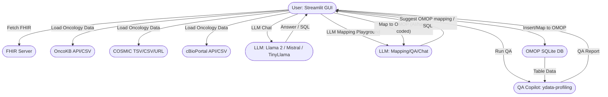
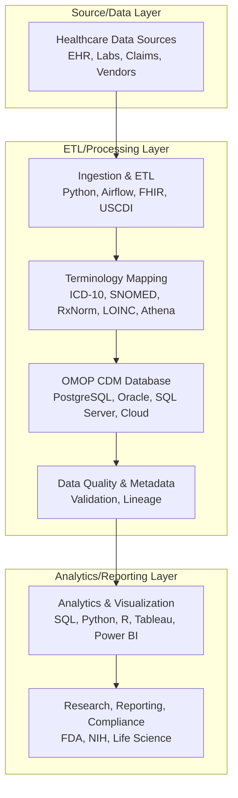

# FHIR → OMOP Agent + QA Copilot


This app demonstrates a local, LLM-powered pipeline for mapping FHIR resources to OMOP tables, running data quality checks, and experimenting with LLM prompts—all from a Streamlit GUI. The project is organized for extensibility, with a modular folder structure for future integrations (e.g., oncology DB, on-premise DB).

---

## Technical & Data Process Diagram (with AI/LLM Emphasis)



**Diagram: Technical & Data Process with AI/LLM Emphasis**
- User can interact with FHIR, OMOP, and oncology data sources (OncoKB, COSMIC, cBioPortal) via the GUI.
- LLM/AI is used for chat, mapping suggestions, QA, and SQL generation at multiple steps (highlighted in orange).
- Data flows from sources through AI-powered mapping and QA into OMOP, with results and reports returned to the user.

---

## Data Workflow & System Integration

This project implements a modern clinical data engineering workflow, integrating healthcare standards, terminologies, databases, and analytics tools:

1. **Healthcare Data Sources:** EHRs, labs, registries, claims, and vendors provide data, often in HL7 FHIR format and containing USCDI-required elements. Example files: `data/person_sample.csv`, `data/observation_sample.csv`.
2. **Ingestion & ETL:** ETL pipelines (e.g., `core/etl/etl_load.py`) extract data from FHIR APIs, files, or databases, transform and map fields/codes to OMOP CDM tables and vocabularies (using mapping tables or vocabularies from Athena), and load harmonized data into relational databases (PostgreSQL, Oracle, SQL Server).
3. **Terminology Mapping:** Local codes (ICD-10, SNOMED, LOINC, etc.) are mapped to OMOP standard concept IDs using mapping tables or vocabularies. OMOP vocabularies are typically downloaded in bulk from the OHDSI Athena platform (https://athena.ohdsi.org/) and loaded into your database for use in the ETL process. See `data/code_mapping_sample.csv` for a demo.
4. **OMOP CDM Database:** OMOP CDM data is stored in scalable RDBMS or cloud data warehouses and can be integrated with data lakes for large-scale analytics. Schema: `docs/omop_cdm_schema.sql`.
5. **Data Quality & Metadata:** Automated validation checks for completeness, consistency, referential integrity, and code mapping are included in the ETL script. Data lineage and transformation steps are documented in the code and README.
6. **Analytics, Visualization, and Reporting:** SQL, Python (pandas, matplotlib), R, Tableau, and Power BI are used for cohort selection, EDA, modeling, dashboards, and regulatory reporting. See `core/etl/analytics_visualization.py` and charts in `docs/`.

### Data Workflow Diagram



---

## Features

- Modular codebase for easy extension and maintenance
- LLM Chat: ask any question to the LLM (choose model for speed/quality)
- LLM Mapping Prompt Playground: experiment with custom prompts and any data (e.g., CSV columns, FHIR JSON) for OMOP mapping suggestions
- Oncology Data Loader Demos:
   - OncoKB: Load via API (institutional email required) or upload CSV
   - COSMIC: Upload TSV/CSV or load from public URL
   - cBioPortal: Load clinical/molecular data via API (study ID) or upload CSV; list and fetch available molecular profiles (mutation, copy number, mRNA, etc.)
- Fetch FHIR resources (Patient, Condition, Encounter, and more) from the public HAPI FHIR server
- Review FHIR resources in table format
- Map FHIR resources to OMOP tables (person, condition_occurrence, visit_occurrence) using robust Python logic with LLM fallback
- Run QA profiling on OMOP tables (ydata-profiling)
- Generate OMOP SQL from FHIR JSON using LLM (Llama 2, Mistral, TinyLlama via Ollama)

## Project Structure

```
fhir_omop_agent/
├── app.py                  # Main Streamlit app
├── core/                   # Core logic: mapping, QA, FHIR/OMOP sample generation
│   ├── fhir_to_omop.py
│   ├── qa_copilot.py
│   ├── fetch_fhir_samples.py
│   └── generate_omop_samples.py
├── utils/                  # Utility functions (db_utils.py, fhir_utils.py)
├── integration/            # Future integrations (oncology, on_premise)
│   ├── oncology/
│   └── on_premise/
├── data/                   # Sample FHIR/OMOP data, external data
│   ├── sample_fhir/
│   ├── sample_omop/
│   └── external/
├── mermaid_diagram.md      # System architecture diagram
└── README.md
```

## Setup
1. **Install dependencies:**
   ```bash
   pip install -r requirements.txt
   # Or manually: streamlit pandas ydata-profiling requests ollama
   ```
2. **Install Ollama and pull models:**
   ```bash
   # Install Ollama from https://ollama.com/
   ollama pull llama2
   ollama pull mistral
   ollama pull tinyllama
   ```
3. **Run the app:**
   ```bash
   streamlit run fhir_omop_agent/app.py
   ```

## Extending the Project

- Add new mapping logic or QA modules in `core/`
- Add utility functions in `utils/`
- Integrate external or on-premise data sources in `integration/`
- Place sample or external data in `data/`


## Usage

- **LLM Chat:** Ask any question to the LLM (choose model for speed/quality).
- **LLM Mapping Prompt Playground:** Enter a custom prompt and sample data (e.g., CSV columns, FHIR JSON) to get OMOP mapping suggestions from the LLM.
- **Oncology Data Loader Demos:**
   - **OncoKB:** Enter API token and gene, or upload a CSV file. Preview and analyze variant data.
   - **COSMIC:** Upload a COSMIC TSV/CSV file or enter a public URL. Preview and analyze mutation data.
   - **cBioPortal:** Enter a study ID to fetch clinical/molecular data via API, or upload a CSV. List and fetch available molecular profiles (mutation, copy number, mRNA, etc.).
- **FHIR Resource Viewer:** Fetch and review FHIR resources from the HAPI FHIR server. Select resource type and number of rows.
- **Map to OMOP:** After fetching Patient, Condition, or Encounter, click "Map to OMOP" to populate the OMOP SQLite database (`omop_demo.db`).
- **Run QA:** Select an OMOP table and run data profiling (QA) with ydata-profiling.

## Notes

- Modular structure supports future growth and integration with external data sources (e.g., oncology DB, on-premise OMOP, cBioPortal, COSMIC, OncoKB).
- The OMOP database is `omop_demo.db` in your project directory. It is dynamic and updated by the app.
- The app uses robust hard-coded mapping for speed, with LLM fallback for flexibility.
- You can add more OMOP tables and FHIR resource mappings as needed.
- LLM features (chat, mapping playground) are available at the top of the app for rapid prototyping and mapping suggestions.

## Requirements

## Unified Configuration
All database, data, and output settings are managed in `config.yaml` at the project root. The Streamlit app, ETL, and analytics modules use these defaults, but you can override them via the GUI or CLI arguments.

Example `config.yaml`:
```yaml
database:
   backend: sqlite  # 'sqlite' or 'postgresql'
   sqlite_path: omop_demo.db
   postgresql:
      user: clinical_user
      password: StrongPassword123
      host: localhost
      port: 5432
      db: clinical_demo
data:
   base_dir: data
   person_sample: person_sample.csv
   observation_sample: observation_sample.csv
   code_mapping_sample: code_mapping_sample.csv
docs:
   output_dir: docs
```

You can edit this file to set your preferred defaults. The Streamlit sidebar and CLI options will always take precedence if set.

## ETL/Analytics (Script Mode)
Use the scripts in `core/etl/` to load, validate, and analyze OMOP data with your choice of database backend (SQLite or PostgreSQL).

### Example Usage
```bash
# Run ETL with SQLite (default)
python core/etl/etl_load.py

# Run ETL with PostgreSQL
DB_USER=... DB_PASS=... DB_HOST=... DB_PORT=... DB_NAME=... python core/etl/etl_load.py --db_type postgresql

# Run analytics/visualization
python core/etl/analytics_visualization.py
```

See each script for details and options. The unified database utility in `utils/db_utils.py` supports both SQLite and PostgreSQL.

## License
MIT
