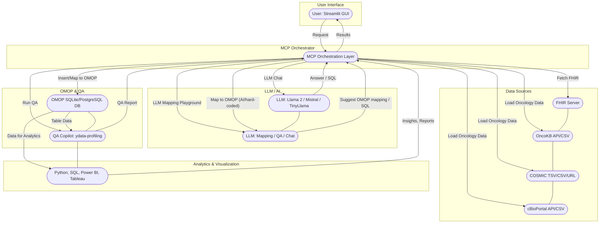

# Recent Updates (September 2025)

### Bug Fixes & Improvements

- Fixed ETL and QA file path handling: All file paths are now resolved using `config.yaml` and robust path logic in the MCP orchestrator. No more hardcoded or missing file errors.
- Improved FHIR → OMOP mapping for the `person` table: The mapping now matches the OMOP schema (7 columns) and ensures all values are integers or `None` as required by the database, preventing datatype mismatch errors.
- Enhanced error handling: The app now provides clearer error messages for missing files, schema mismatches, and datatype issues.
- Streamlit UI and full MCP pipeline: The "Run Full MCP Pipeline" button now works end-to-end, routing all steps (ETL, LLM mapping, QA, analytics) through the orchestrator.
- Documentation and code comments updated to reflect these changes.

### FHIR → OMOP Person Table Mapping

The mapping from FHIR Patient resources to the OMOP `person` table now follows this logic:

- `person_id`: FHIR `id` (converted to integer if possible)
- `gender_concept_id`: Not mapped by default (set to `None`), but can be extended to map gender strings to OMOP concept IDs
- `year_of_birth`, `month_of_birth`, `day_of_birth`: Parsed from FHIR `birthDate` (YYYY-MM-DD)
- `race_concept_id`, `ethnicity_concept_id`: Not mapped by default (set to `None`), but can be extended

All values are cast to integers or set to `None` to match the OMOP schema and avoid database errors.

### Configuration

All file paths, database settings, and output directories are managed in `config.yaml`. The orchestrator and all modules use this config for robust, portable execution.

---
# FHIR → OMOP Agent + QA Copilot


This app demonstrates a local, LLM-powered pipeline for mapping FHIR resources to OMOP tables, running data quality checks, and experimenting with LLM prompts—all from a Streamlit GUI. The project is organized for extensibility, with a modular folder structure for future integrations (e.g., oncology DB, on-premise DB).

---

## MCP Orchestration Layer (NEW)

**This project now features a modular MCP Orchestrator, which coordinates the entire FHIR → OMOP + QA pipeline.**

- All ETL, analytics, LLM mapping, and QA steps are now orchestrated via a unified `MCPOrchestrator` class (see `core/orchestration/mcp_orchestrator.py`).
- The Streamlit UI routes all ETL, analytics, LLM mapping, and QA actions through the orchestrator, matching the architecture diagram.
- A new "Run Full MCP Pipeline" button in the UI executes the entire workflow in one click.
- This enables stepwise execution, logging, and future extensibility for distributed or async orchestration.


---

## Technical & Data Process Diagram (with AI/LLM Emphasis)


**Diagram: Technical & Data Process with AI/LLM Emphasis**
- User can interact with FHIR, OMOP, and oncology data sources (OncoKB, COSMIC, cBioPortal) via the GUI.
- LLM/AI is used for chat, mapping suggestions, QA, and SQL generation at multiple steps (highlighted in orange).
- Data flows from sources through AI-powered mapping and QA into OMOP, with results and reports returned to the user.

---

## Data Workflow & System Integration

This project implements a modern clinical data engineering workflow, integrating healthcare standards, terminologies, databases, and analytics tools:

1. **Healthcare Data Sources:** EHRs, labs, registries, claims, and vendors provide data, often in HL7 FHIR format and containing USCDI-required elements. Example files: `data/person_sample.csv`, `data/observation_sample.csv`.
2. **Ingestion & ETL:** ETL pipelines (e.g., `core/etl/etl_load.py`) extract data from FHIR APIs, files, or databases, transform and map fields/codes to OMOP CDM tables and vocabularies (using mapping tables or vocabularies from Athena), and load harmonized data into relational databases (PostgreSQL, Oracle, SQL Server).
3. **Terminology Mapping:** Local codes (ICD-10, SNOMED, LOINC, etc.) are mapped to OMOP standard concept IDs using mapping tables or vocabularies. OMOP vocabularies are typically downloaded in bulk from the OHDSI Athena platform (https://athena.ohdsi.org/) and loaded into your database for use in the ETL process. See `data/code_mapping_sample.csv` for a demo.
4. **OMOP CDM Database:** OMOP CDM data is stored in scalable RDBMS or cloud data warehouses and can be integrated with data lakes for large-scale analytics. Schema: `docs/omop_cdm_schema.sql`.
5. **Data Quality & Metadata:** Automated validation checks for completeness, consistency, referential integrity, and code mapping are included in the ETL script. Data lineage and transformation steps are documented in the code and README.
6. **Analytics, Visualization, and Reporting:** SQL, Python (pandas, matplotlib), R, Tableau, and Power BI are used for cohort selection, EDA, modeling, dashboards, and regulatory reporting. See `core/etl/analytics_visualization.py` and charts in `docs/`.

### Data Workflow Diagram



---


## Features

- **MCP Orchestration Layer:** Unified orchestrator for ETL, analytics, LLM mapping, and QA (see architecture diagram)
- Modular codebase for easy extension and maintenance
- LLM Chat: ask any question to the LLM (choose model for speed/quality)
- LLM Mapping Prompt Playground: experiment with custom prompts and any data (e.g., CSV columns, FHIR JSON) for OMOP mapping suggestions, now routed through the orchestrator
- Oncology Data Loader Demos:
   - OncoKB: Load via API (institutional email required) or upload CSV
   - COSMIC: Upload TSV/CSV or load from public URL
   - cBioPortal: Load clinical/molecular data via API (study ID) or upload CSV; list and fetch available molecular profiles (mutation, copy number, mRNA, etc.)
- Fetch FHIR resources (Patient, Condition, Encounter, and more) from the public HAPI FHIR server
- Review FHIR resources in table format
- Map FHIR resources to OMOP tables (person, condition_occurrence, visit_occurrence) using robust Python logic with LLM fallback
- Run QA profiling on OMOP tables (ydata-profiling), now routed through the orchestrator
- Generate OMOP SQL from FHIR JSON using LLM (Llama 2, Mistral, TinyLlama via Ollama), now via orchestrator
- **Run Full MCP Pipeline:** One-click button in the UI to execute ETL, LLM mapping, QA, and analytics in sequence

## Project Structure


<!-- The Data Workflow Diagram is now combined above for clarity and consistency. -->
   pip install -r requirements.txt
   # Or manually: streamlit pandas ydata-profiling requests ollama
   ```
2. **Install Ollama and pull models:**
   ```bash
   # Install Ollama from https://ollama.com/
   ollama pull llama2
   ollama pull mistral
   ollama pull tinyllama
   ```
3. **Run the app:**
   ```bash
   streamlit run fhir_omop_agent/app.py
   ```

## Extending the Project

- Add new mapping logic or QA modules in `core/`
- Add utility functions in `utils/`
- Integrate external or on-premise data sources in `integration/`
- Place sample or external data in `data/`


## Usage

- **LLM Chat:** Ask any question to the LLM (choose model for speed/quality).
- **LLM Mapping Prompt Playground:** Enter a custom prompt and sample data (e.g., CSV columns, FHIR JSON) to get OMOP mapping suggestions from the LLM. Now uses the MCP orchestrator for all mapping logic.
- **Oncology Data Loader Demos:**
   - **OncoKB:** Enter API token and gene, or upload a CSV file. Preview and analyze variant data.
   - **COSMIC:** Upload a COSMIC TSV/CSV file or enter a public URL. Preview and analyze mutation data.
   - **cBioPortal:** Enter a study ID to fetch clinical/molecular data via API, or upload a CSV. List and fetch available molecular profiles (mutation, copy number, mRNA, etc.).
- **FHIR Resource Viewer:** Fetch and review FHIR resources from the HAPI FHIR server. Select resource type and number of rows.
- **Map to OMOP:** After fetching Patient, Condition, or Encounter, click "Map to OMOP" to populate the OMOP SQLite database (`omop_demo.db`).
- **Run QA:** Select an OMOP table and run data profiling (QA) with ydata-profiling. Now uses the MCP orchestrator for all QA logic.
- **Run Full MCP Pipeline:** Click the "Run Full MCP Pipeline" button to execute ETL, LLM mapping, QA, and analytics in sequence, with results shown in the UI.

## Notes

- Modular structure supports future growth and integration with external data sources (e.g., oncology DB, on-premise OMOP, cBioPortal, COSMIC, OncoKB).
- The OMOP database is `omop_demo.db` in your project directory. It is dynamic and updated by the app.
- The app uses robust hard-coded mapping for speed, with LLM fallback for flexibility.
- You can add more OMOP tables and FHIR resource mappings as needed.
- LLM features (chat, mapping playground) are available at the top of the app for rapid prototyping and mapping suggestions.

## Requirements

## Unified Configuration
All database, data, and output settings are managed in `config.yaml` at the project root. The Streamlit app, ETL, and analytics modules use these defaults, but you can override them via the GUI or CLI arguments.

Example `config.yaml`:
```yaml
database:
   backend: sqlite  # 'sqlite' or 'postgresql'
   sqlite_path: omop_demo.db
   postgresql:
      user: clinical_user
      password: StrongPassword123
      host: localhost
      port: 5432
      db: clinical_demo
data:
   base_dir: data
   person_sample: person_sample.csv
   observation_sample: observation_sample.csv
   code_mapping_sample: code_mapping_sample.csv
docs:
   output_dir: docs
```

You can edit this file to set your preferred defaults. The Streamlit sidebar and CLI options will always take precedence if set.

## ETL/Analytics (Script Mode)
Use the scripts in `core/etl/` to load, validate, and analyze OMOP data with your choice of database backend (SQLite or PostgreSQL).

### Example Usage
```bash
# Run ETL with SQLite (default)
python core/etl/etl_load.py

# Run ETL with PostgreSQL
DB_USER=... DB_PASS=... DB_HOST=... DB_PORT=... DB_NAME=... python core/etl/etl_load.py --db_type postgresql

# Run analytics/visualization
python core/etl/analytics_visualization.py
```


See each script for details and options. The unified database utility in `utils/db_utils.py` supports both SQLite and PostgreSQL.

---

## MCP Orchestrator Example (Script Mode)

You can also use the orchestrator directly in a script or notebook:

```python
from core.orchestration.mcp_orchestrator import MCPOrchestrator

# Instantiate orchestrator (uses config.yaml by default)
orchestrator = MCPOrchestrator()

# Example FHIR resource (replace with your actual FHIR JSON)
fhir_json = {
   "resourceType": "Patient",
   "id": "123",
   "gender": "female",
   "birthDate": "1980-01-01"
}

# Path to CSV and output HTML for QA (replace with your actual file/table)
qa_csv = "person.csv"
qa_html = "qa_report_person.html"

# Run the full pipeline
results = orchestrator.orchestrate(
   steps=['etl', 'llm_mapping', 'qa', 'analytics'],
   fhir_json=fhir_json,
   table="person",
   qa_csv=qa_csv,
   qa_html=qa_html
)

print("Pipeline results:")
print(results)
```

## License
MIT
